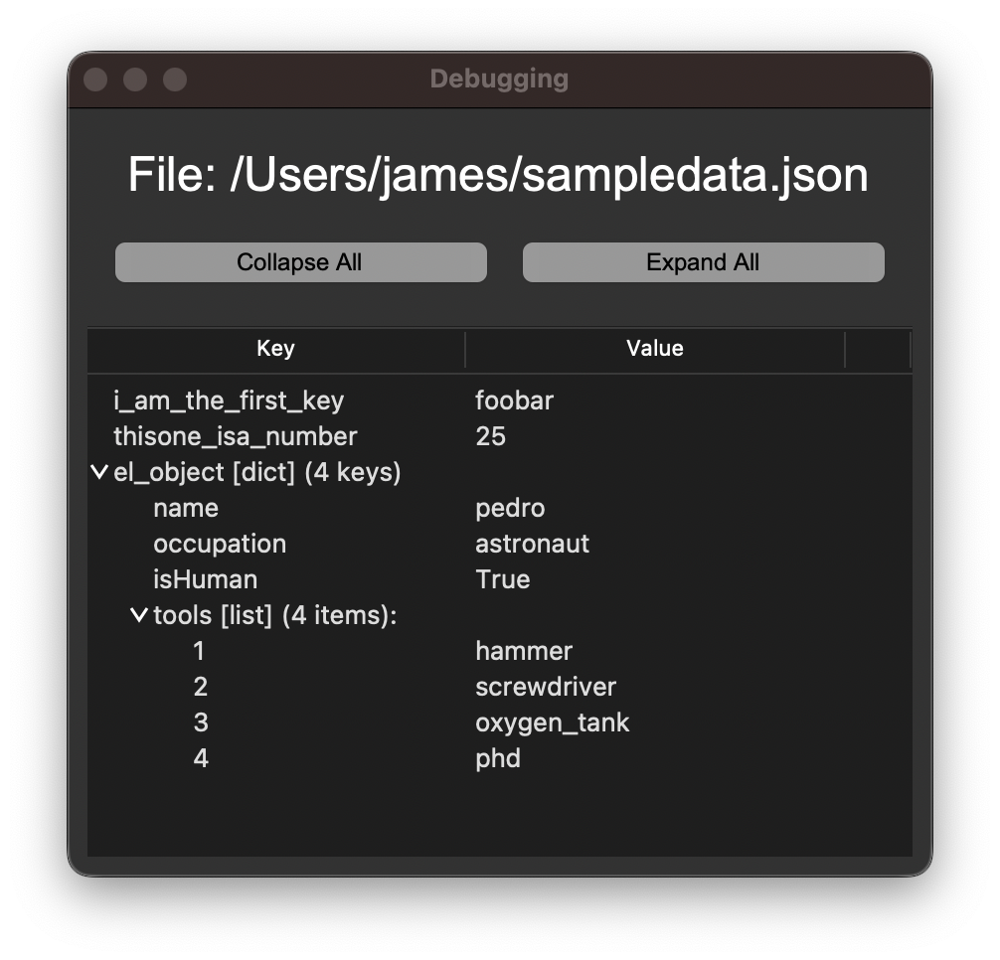

# TreeView

[](License.txt)

A simple utility for macOS to load json/yaml data from stdin or a file and render a nice interactive treeview to explore it.

When given data from stdin, it will try to parse as json, and then yaml. 

If you pick a file, or provide a file as argument, other formats can be decoded:
* json (`.json`)
* yaml (`.yaml`, `.yml`)
* csv (`.csv`)
* tsv (`.tsv`)
* excel (`.xls`, `.xslx`)
* openoffice sheets (`.ods`)
* sqlite3 (`.db`, `.sqlite`, `.sqlite3`)

Table-like data files are translated through `pandas`. For a more table-oriented tool, check out [TableView](https://github.com/bishopdynamics/TableView).



## Build & Install

This was developed on macOS 12/13 using `Python 3.10.4` with tk installed via brew: `brew install python-tk`. 
If you do not install tk via brew, you will have a bad time.

Build the app with: `./build-app.sh`, then find `TreeView.app` in `./dist/` 

Drag `TreeView.app` into your Applications folder.

## Usage

Open the app, and it will prompt you to select a file ending in `.json`, `.yaml`, or `.yml`

There are three ways to use it from terminal:
* pipe data to stdin: `cat sampledata.json | /Applications/TreeView.app/Contents/MacOS/TreeView`
* read data from a file: `/Applications/TreeView.app/Contents/MacOS/TreeView sampledata.json`
* use a file selection dialog: `/Applications/TreeView.app/Contents/MacOS/TreeView`


## Symlink
I like to throw a symlink my `~/bin/`
```bash
ln -s /Applications/TreeView.app/Contents/MacOS/TreeView ~/bin/treeview

# direct
treeview sampledata.json
treeview sampledata.yaml

# stdin
cat sampledata.json |treeview
cat sampledata.yaml |treeview

# stdin alternate syntax
treeview < sampledata.json
```

## STDIN Race Condition
What if I have a race condition with my stdin? 

Let's say you run a script which takes a few seconds before it spits out json to stdout, and you pipe that into `treeview`.

```bash
# this script takes a few seconds before it prints a json string
python3 get-lots-of-data.py |treeview
```

No problem! At first, the app will not find anything in stdin, so the filedialog will appear, 
just wait a few seconds to let your script finish, then hit "Cancel" button.

After you hit "Cancel" the app will check stdin again, and if it finds data it will re-exec itself with that data to stdin.

## Testing

For testing, you can build & run it all at once with `./run.sh sampledata.json`

## Linux and other Unix-like systems

I only tested this on macOS, but this is all really basic python3 with tkinter, built into a macOS app using pyinstaller. It should be trivial to tweak it to work on any other system, and might already work out of the box.
