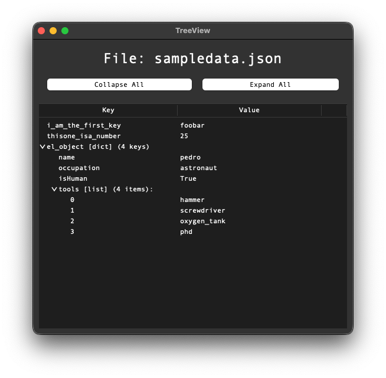

# TreeView

A simple utility for macOS to load json data from stdin or a file and render a nice interactive treeview to explore it.

[GPLv3 license](License.txt)



## Build & Install

build it with: `./build-app.sh`, then find the app in `./dist/` 

Drag `TreeView.app` into your Applications folder.

## Usage

Open the app, and it will prompt you to select a file ending in `.json`

There are three ways to use it from terminal:
* pipe data to stdin: `cat sampledata.json | /Applications/TreeView.app/Contents/MacOS/TreeView`
* read data from a file: `/Applications/TreeView.app/Contents/MacOS/TreeView sampledata.json`
* use a file selection dialog: `/Applications/TreeView.app/Contents/MacOS/TreeView`


I like to throw a symlink my `~/bin/`
```bash
ln -s /Applications/TreeView.app/Contents/MacOS/TreeView ~/bin/treeview

# direct
treeview sampledata.json

# stdin
cat sampledata.json |treeview
```

for testing, you can build & run it all at once with `./run.sh sampledata.json`

## Linux and other Unix-like systems

I only tested this on macOS, but this is all really basic python3 with tkinter, built into a macOS app using pyinstaller. It should be trivial to tweak it to work on any other system, and might already work out of the box.
